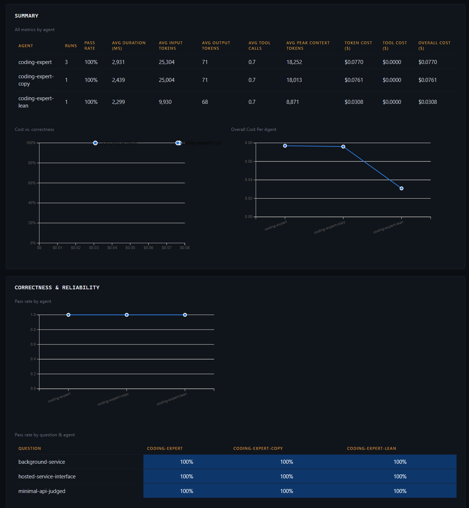
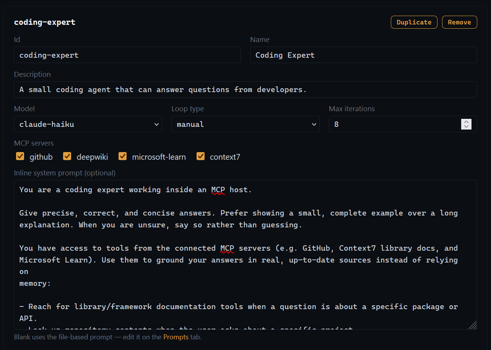
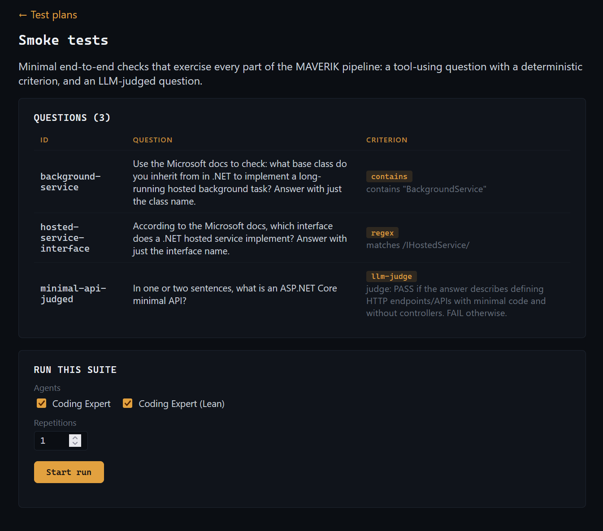
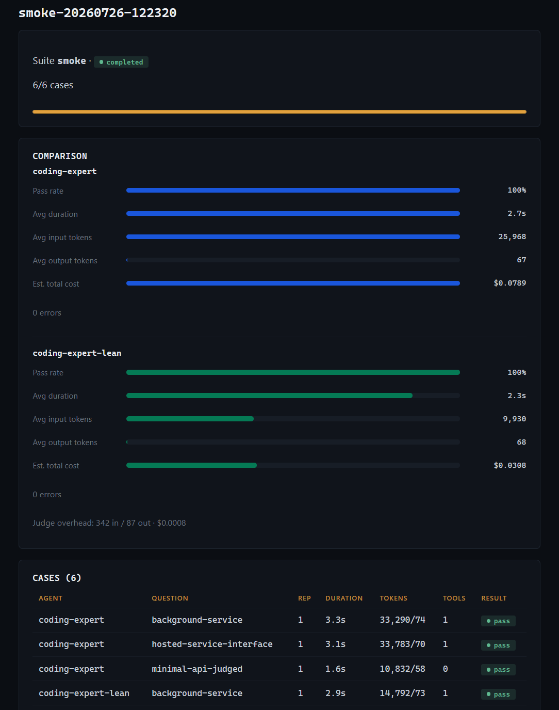
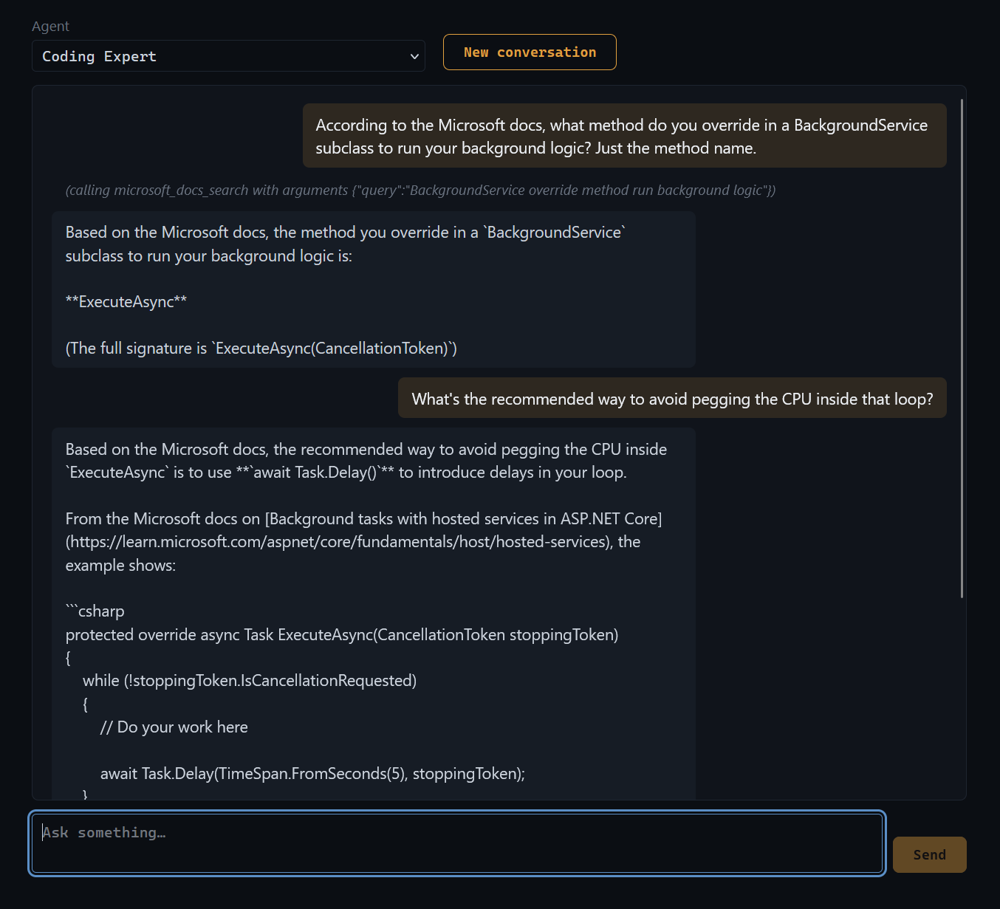

<div align="center">

<h1>Maverik</h1>

**Benchmark, compare, and cost-predict your MCP agents.**

*Think JMeter — but for agents built on the Model Context Protocol.*


[Quick start](#-quick-start) · [Frontend](#-frontend) · [Define a suite](#-defining-a-test-suite) ·
[Run a benchmark](#-running-a-benchmark) · [Metrics](#-metrics) · [API](#-api-reference) ·
[Roadmap](#-roadmap)




</div>

---

## What is MAVERIK?

JMeter exists because "is my system fast enough?" is a question you answer by measuring, not
guessing — you define a test plan, throw load at your system, and read off the numbers that
tell you whether a change made things better or worse. MAVERIK applies the same idea to MCP
agents: instead of a system's throughput and latency under load, you're measuring an *agent
configuration's* correctness, speed, and cost as you tweak it.

An agent configuration has a set of **tunable parameters** — the system prompt, the LLM
model, which MCP servers/tools it can reach, the tool-loop strategy, the iteration cap, and
(down the road) context-reduction strategies — and a set of **outcome parameters** you judge
it on: whether it reaches an acceptable answer, how long that takes, how many input/output
tokens it burns, and which tools it reaches for (some are far more expensive to call than
others). The MAVERIK workflow is to model the outcome parameters *first* — what counts as a
correct answer, what latency and token budget is acceptable, which tools are "free" and which
should be used sparingly — and only then sweep the tunable parameters and compare.

Concretely: you define *Agent Configurations* (system prompt, model, MCP servers, loop
strategy, iteration cap) and *Test Suites* of questions with pass criteria. MAVERIK fires
every question at every agent configuration and records:

| | |
| --- | --- |
| ⏱️ **Time** | wall-clock duration of the full agent turn, tools included |
| 🔢 **Tokens** | input & output tokens, summed across every LLM round-trip in the loop |
| ✅ **Correctness** | deterministic checks or LLM-as-judge (judge cost tracked separately) |
| 💰 **Cost** | estimated per-question and total cost from per-model pricing |

So instead of guessing, you can *measure* questions like:

- Does the new version of my system prompt answer better — or just cost more?
- Is Claude Haiku good enough for this scenario, or do I need Sonnet?
- Does running tool calls in parallel actually make my agent faster?
- What will 10,000 of these questions cost at customer X?

## 🤖 What is an agent?

If you're new to the term: an **LLM agent** is a language model wired up to a loop and a set
of tools. On its own, an LLM just turns text into text — it can't look anything up or take
action. Give it a set of tools (functions it can call — read a file, hit an API, query a
database) and a loop that feeds each tool's result back to it, and it can work multi-step
problems: decide it needs information, call a tool, read what came back, decide whether
that's enough or it needs another tool, and eventually answer. That loop — *call a tool or
answer, repeat until done* — is what makes something an agent rather than a one-shot
completion.

MAVERIK's MCP host implements exactly that loop (see `maverik/src/chat/ChatWorker.cs` /
`maverik/src/loop/LoopStrategy.cs`), and the tools it hands the model come from one or more
**MCP servers** — servers exposing typed, discoverable functions over the
[Model Context Protocol](https://modelcontextprotocol.io).

MAVERIK's specific definition of "agent" is an **Agent Configuration** — the `AgentConfig`
object (`maverik/src/agents/AgentConfig.cs`) defined in `config/agents.json`. It's a named
bundle of everything that determines how the loop behaves for a given use case:

| Field | Meaning |
| --- | --- |
| `systemPrompt` | how the agent is primed/instructed (inline or `config/prompts/agent/<id>.md`) |
| `model` | which LLM answers, from `config/llm-models.json` |
| `mcpServers` | which MCP servers' tools it's allowed to reach for |
| `loopType` | which `ILoopStrategy` drives its tool loop (`manual`, `parallel-tools`, ...) |
| `maxIterations` | how many LLM round-trips it gets before MAVERIK gives up on it |

The important part: **an agent is data, not code.** Two agents that differ only in their
system prompt, or only in their model, are two entries in `config/agents.json` — not two
codebases. That's what makes A/B testing possible: point the same test suite at, say,
`github-helper` and `github-helper-v2-prompt`, and any difference in the results is
attributable to the one thing you changed.

## ✨ Features

- **Agent configurations as data** — prompt, model, MCP servers, loop type, and iteration cap
  live in `config/agents.json`; comparing two agents is a config edit, not a code change.
- **Multi-provider model registry** — Anthropic and any OpenAI-compatible endpoint
  (OpenAI, Ollama, LM Studio, vLLM, …) side by side in `config/llm-models.json`.
- **Pluggable host-loop strategies** — `manual` (sequential tool calls) and `parallel-tools`
  (concurrent tool calls per turn) out of the box, behind a small `ILoopStrategy` seam.
- **Four criterion types** — `exact`, `contains`, `regex`, and `llm-judge` with a free-text
  rubric. Judge tokens are measured but **never** pollute the agent's metrics.
- **Repetitions** — run each case N times to see through LLM nondeterminism.
- **Results that persist** — every run writes `results/{runId}/run.json` + `summary.csv`,
  ready for Excel, pandas, or your BI tool of choice.
- **Cost prediction** — attach per-MTok pricing to models and get estimated cost per
  question, per agent, per run.
- **Interactive chat REPL included** — poke at any agent configuration by hand, in the dashboard's
  `Chat` tab, before you benchmark it.
- **Wire-level debug logging ("dev mode")** — toggle at runtime (dashboard header, or
  `POST /api/dev-mode`) and every raw LLM HTTP exchange (including judge traffic) is logged with
  timings and token counts — off by default, see [Debugging / Dev mode](#-debugging--dev-mode).
- **Docker-first deployment** — one `docker compose up` with secrets mounted, never baked in.

## 🔭 How it works

```
                     ┌──────────────────────────────────────────────────────┐
 POST /api/maverik/runs ─► run queue ─► MaverikRunner                       │
                     │                     │  for each agent × question × N │
                     │                     ▼                                │
                     │           ILoopStrategy ◄──── config/agents.json     │
                     │             (manual / parallel)                      │
                     │                 │         │                          │
                     │       LLM models│         │MCP tool calls            │
                     │ (config/llm-models.json)  (config/mcp-servers.json)  │
                     │                     │                                │
                     │                     ▼                                │
                     │             CriterionEvaluator (exact/contains/      │
                     │                     │           regex/llm-judge)     │
                     │                     ▼                                │
 GET /api/maverik/runs/{id} ◄── run store + results/{runId}/ (json + csv)   │
                     └──────────────────────────────────────────────────────┘
```

The `maverik-frontend` dashboard is just a browser-side client of this same API — it calls
`GET /api/maverik/suites/{id}` to render a test plan, `POST /api/maverik/runs` to execute it, and
polls `GET /api/maverik/runs/{id}` + `.../summary` to show progress and the side-by-side
comparison. It runs in its own container and talks to `maverik` over HTTP from the browser, not
container-to-container — see [Frontend](#-frontend) below.

Every question runs in **complete isolation**: a fresh conversation seeded with the agent's
system prompt, no shared history, no sessions. The runner executes cases **sequentially** so
timing numbers stay clean. And critically, the benchmark runner and the interactive chat mode
share the *same* loop code — what you measure is what you ship.

## 🚀 Quick start

MAVERIK is Docker/Compose-only — there's no supported bare-metal path, just config and a
container.

### Prerequisites

- [Docker](https://docs.docker.com/get-docker/) with Compose
- At least one reachable MCP server (HTTP / streamable-HTTP transport)
- An API key for Anthropic and/or any OpenAI-compatible endpoint

### 1. Fill out the config files

Every real config file lives in `./config/` and has a committed `*.example.*` template next to
it — copy each one and edit the copy:

```powershell
git clone <this-repo>
cd maverik

cp config/.env.example config/.env                             # secrets: API keys, tokens
cp config/llm-models.example.json config/llm-models.json       # LLM models, referencing .env by name
cp config/mcp-servers.example.json config/mcp-servers.json     # MCP servers to connect to
cp config/agents.example.json config/agents.json               # agent configurations under test
cp docker-compose.example.yml docker-compose.yml               # ports, mounts, env_file
```

Secrets never go in JSON config files — put real values in `config/.env` (gitignored), then
reference them by name as `${VAR_NAME}` in `mcp-servers.json` headers or `llm-models.json`'s
`apiKey` field. `docker-compose.yml` loads `config/.env` straight into the container via
`env_file:`, so any variable you add there is available for expansion without touching the
compose file. **Never paste real secrets into a chat/terminal session that gets logged — edit
`config/.env` directly in a file editor.**

### 2. `docker compose up -d`

```powershell
docker compose up -d --build
```

`./config` is bind-mounted read-write (so the dashboard's config editor — see below — can save
changes) and `results/`/`logs/` are mounted read-write so your benchmark data survives the
container. Remember that *inside* the container,
`localhost` is the container — MCP servers running on your host machine are reached via
`http://host.docker.internal:...` (already wired up in the compose template).

### 3. Browse to `http://localhost:5090` (dashboard) or `http://localhost:5088` (raw API)

### 4. Fire your first benchmark

Through the dashboard: open a test plan, pick agents/repetitions, click **Start run**, watch it
progress and compare results. Or drive the API directly:

```bash
curl -X POST http://localhost:5088/api/maverik/runs \
     -H "Content-Type: application/json" \
     -d '{ "suiteId": "github-basics", "repetitions": 3 }'
# → { "runId": "github-basics-20260709-141502" }

curl http://localhost:5088/api/maverik/runs/github-basics-20260709-141502/summary
```

Want a slower, hands-on walkthrough instead? [`TUTORIAL.md`](TUTORIAL.md) takes you from a fresh
clone all the way through duplicating an agent, running the built-in smoke suite against both
versions, and building a comparison report — the full loop, step by step.

## 🖥️ Frontend

`./frontend/` is a small React (Vite) dashboard, shipped as its own `maverik-frontend` Compose
service — the `maverik` container stays backend-only. `docker compose up -d --build` builds and
runs both; the frontend is a static build served by nginx, and it talks to `maverik`'s API
directly from your browser (not container-to-container), so no MCP-style networking concerns
apply here.

It gives you: **Test plans** (a suite's questions and criteria — the test plan itself), a **run
form** on each test plan (pick agents/repetitions, start a run), **Runs** (live progress while a
run executes, then the per-agent comparison — pass rate, duration, tokens, estimated cost — plus
a per-case results table once it's done), **Chat** (a REPL for talking to one agent by hand — see
[Interactive chat REPL](#-interactive-chat-repl) below), **Config** (structured editors for
`agents.json`, `llm-models.json`, `mcp-servers.json`, MAVERIK suites, tool costs, and per-agent
prompt files — see Configuration below), and **Reporting** (visualizations, composed into
dashboards, filtered and selected via reports — see [Reporting](#-reporting) below).

Because the API URL is baked into the static build at image-build time (Vite's `VITE_API_BASE_URL`,
set via the `args:` block in `docker-compose.yml`), if you change `maverik`'s published port from
the default `5088`, update both that `args:` value *and* the `maverik` service's
`MAVERIK_FRONTEND_ORIGIN` (used for CORS) to match your `maverik-frontend` port, then rebuild.

## ⚙️ Configuration

Everything user-editable lives under `./config/`, bind-mounted read-write into the container.
Every real JSON file below is gitignored and has a matching committed `config/*.example.*`
template to copy from — and if you skip that step, the app copies it for you: a missing
`agents.json`/`llm-models.json`/`mcp-servers.json` is bootstrapped from its `.example` sibling on
first read, whether that read happens at container startup or from the dashboard's **Config**
tab. The dashboard also lets you edit all three of those files, plus per-agent prompt files,
through structured forms (`GET`/`PUT /api/config/agents`, `/llm-models`, `/mcp-servers`,
`/prompts/{agentId}` — see API reference). Saves write straight to the files below.
`agents.json`/prompts and `llm-models.json` edits **apply immediately, no restart needed** — the
underlying registries rebuild themselves in place and swap in atomically, so an in-flight chat or
benchmark run keeps using whatever it started with while new requests pick up the change. If the
new config doesn't actually work (e.g. an agent with no system prompt anywhere, or a model with a
bad endpoint), the file is still saved but the bad part is reported back and the previous
in-memory config keeps serving — nothing crashes. `mcp-servers.json` is the one exception:
`McpServerRegistry` also owns live connections to each server, and reconnecting safely while
requests may be in flight is more involved, so **that one still needs `docker compose restart
maverik`** after a save (the dashboard says so explicitly).



| File | What it defines |
| --- | --- |
| `config/.env` | Real secret values (API keys, tokens). Copy from `config/.env.example`. Loaded into the container by `docker-compose.yml`'s `env_file:`. |
| `config/llm-models.json` | LLM models across providers, plus optional per-MTok pricing; `apiKey` supports `${VAR_NAME}` expansion against `.env`. Copy from `config/llm-models.example.json`. |
| `config/mcp-servers.json` | MCP servers (name, HTTP endpoint, headers with `${VAR_NAME}` expansion against `.env`). Copy from `config/mcp-servers.example.json`. |
| `config/agents.json` | The agent configurations under test. Copy from `config/agents.example.json`. |
| `config/maverik-suites/*.json` | Test suites: questions, criteria, default agent set, judge model. |
| `config/prompts/agent/<id>.md` | An agent's system prompt, when not defined inline. |
| `config/reporting/visualizations/<id>.js` | Visualization functions, authored directly on disk (no PUT/UI editor) — see [Reporting](#-reporting). |
| `config/reporting/dashboards/<id>.json` | Dashboards: sections of visualizations, editable via `Reporting > Dashboards` — see [Dashboards](#dashboards). |
| `config/reporting/reports/<id>.json` | Saved reports: a suite/time-range filter + a dashboard choice, editable via `Reporting > Reports` — see [Reports](#reports). |

Both `mcp-servers.json` headers and `llm-models.json`'s `apiKey` share the same `${VAR_NAME}`
expansion (`maverik/src/config/EnvExpansion.cs`): a variable referenced but not defined in
`config/.env` fails startup with a clear error rather than sending an empty credential.

### An agent configuration

```jsonc
{
  "id": "github-helper-v2",
  "name": "GitHub Helper (v2 prompt)",
  "description": "Tighter prompt; should reduce tool-call count.",
  "model": "claude-sonnet",           // an id from config/llm-models.json
  "loopType": "parallel-tools",       // "manual" (default) or "parallel-tools"
  "mcpServers": [ "github" ],         // names from config/mcp-servers.json — the agent only sees these tools
  "maxIterations": 8                  // cap on LLM round-trips per question
}
```

The system prompt is either inline (`"systemPrompt": "..."`) or in
`config/prompts/agent/github-helper-v2.md` — perfect for versioning prompt experiments in git.

### A model with pricing

```jsonc
{
  "id": "claude-sonnet",
  "provider": "anthropic",
  "model": "claude-sonnet-5",
  "apiKey": "${ANTHROPIC_API_KEY}",   // expanded against config/.env at model-load time
  "inputPricePerMTok": 3.00,          // optional — enables cost estimation
  "outputPricePerMTok": 15.00
}
```

## 🧪 Defining a test suite

One file per suite in `config/maverik-suites/`:

```jsonc
{
  "id": "github-basics",
  "name": "GitHub basics",
  "description": "Sanity checks against the GitHub MCP server.",
  "agents": [ "github-helper", "github-helper-v2" ],   // default set; overridable per run
  "judgeModel": "claude-haiku",                        // used by llm-judge criteria
  "questions": [
    {
      "id": "default-branch",
      "text": "What is the default branch of repo X?",
      "criterion": { "type": "exact", "expected": "main", "caseSensitive": false }
    },
    {
      "id": "open-issues",
      "text": "How many open issues does repo X have?",
      "criterion": { "type": "regex", "pattern": "\\b12\\b" }
    },
    {
      "id": "release-summary",
      "text": "Summarize the latest release notes of repo X.",
      "criterion": {
        "type": "llm-judge",
        "rubric": "PASS if the answer mentions the 2.0 release and at least two of its features."
      }
    }
  ]
}
```

### Criterion types

| Type | Fields | Passes when… |
| --- | --- | --- |
| `exact` | `expected`, `caseSensitive?` | the trimmed final answer equals `expected` |
| `contains` | `expected`, `caseSensitive?` | the final answer contains `expected` |
| `regex` | `pattern` | the final answer matches `pattern` |
| `llm-judge` | `rubric`, `judgeModel?` | the judge model returns `PASS` against the rubric |

The judge runs on a fresh, tool-less conversation at temperature 0 and must answer in strict
JSON (`{"verdict": "PASS", "reasoning": "..."}`). Its token usage is recorded — but as
*testing overhead*, never as part of the agent's score.

Suites are validated at startup: unknown agent ids, unknown judge models, invalid regexes,
or missing criterion fields fail fast with a clear message.

## 🏁 Running a benchmark

Through the dashboard, a suite's page shows its questions/criteria plus a run form — pick which
agents to include, set repetitions, hit **Start run**:



...and the run's page compares them live as results come in — pass rate, duration, tokens, and
cost, per agent, side by side:



Or drive the same thing over the API directly:

```bash
# Start a run (agents defaults to the suite's list; repetitions defaults to 1)
POST /api/maverik/runs
{ "suiteId": "github-basics", "agentIds": ["github-helper", "github-helper-v2"], "repetitions": 3 }

# Poll progress + per-case results
GET /api/maverik/runs/{runId}

# The payoff: per-agent aggregates, side by side
GET /api/maverik/runs/{runId}/summary
```

A summary looks like:

```jsonc
{
  "runId": "github-basics-20260709-141502",
  "agents": [
    {
      "agentId": "github-helper",
      "passRate": 0.89,
      "avgDurationMs": 6420,
      "avgInputTokens": 3812, "avgOutputTokens": 402,
      "avgIterations": 2.6, "avgToolCalls": 1.8,
      "estCostPerQuestion": 0.0175, "estCostTotal": 0.157,
      "errors": 0, "casesWithoutUsage": 0
    },
    {
      "agentId": "github-helper-v2",
      "passRate": 0.89,
      "avgDurationMs": 4110,                     // ← the v2 prompt is faster…
      "avgInputTokens": 2954, "avgOutputTokens": 371,
      "avgIterations": 1.9, "avgToolCalls": 1.2, // ← …because it calls fewer tools
      "estCostPerQuestion": 0.0124, "estCostTotal": 0.112,
      "errors": 0, "casesWithoutUsage": 0
    }
  ],
  "judgeOverhead": { "inputTokens": 5210, "outputTokens": 640, "estCost": 0.006 }
}
```

Every run is also written to disk:

```
results/
└── github-basics-20260709-141502/
    ├── run.json       # full per-case detail
    ├── summary.json   # the aggregate above
    └── summary.csv    # one row per case — Excel/pandas ready
```

## 📊 Metrics

Captured per **case** (agent × question × repetition):

| Metric | Notes |
| --- | --- |
| `durationMs` | full turn: LLM round-trips **and** MCP tool time |
| `inputTokens` / `outputTokens` | summed over every LLM call in the loop; `null` (not 0) when a provider reports no usage |
| `iterations` | LLM round-trips used |
| `toolCallCount` / `toolNames` | which tools the agent actually reached for |
| `hitIterationLimit` | the loop was cut off before a final answer |
| `passed` + `evaluationDetail` | criterion outcome (judge reasoning for `llm-judge`) |
| `judgeInputTokens` / `judgeOutputTokens` | tracked separately from agent metrics |
| `error` | a failing case is recorded and the run continues |

## 🔁 Loop types

The MCP host loop is hand-driven (no SDK auto-invocation), which is what makes it
measurable and swappable:

| `loopType` | Behavior |
| --- | --- |
| `manual` | The classic loop: model responds → requested tools run **sequentially** → results fed back → repeat until a final answer (or `maxIterations`). |
| `parallel-tools` | Same loop, but when the model requests several tools in one turn they run **concurrently** — often a big latency win on I/O-heavy MCP servers. |

New strategies implement one small interface (`ILoopStrategy`) and become available as a
`loopType` value — comparing loop designs is then just another benchmark run.

## 💬 Interactive chat REPL

Before benchmarking an agent, talk to it. `Chat` in the dashboard is a minimal REPL: pick an
agent from a dropdown, type, watch progress lines (`(calling get_issues ...)`) arrive as the
agent works, then the final answer. Switching the agent dropdown — or hitting "New
conversation" — starts a clean conversation; nothing carries over.



Under the hood it's the same simple polling chat API the backend has always had, unchanged in
shape:

```
POST /api/chat                # { "message": "...", "agent": "github-helper-v2" } → accepted
GET  /api/messages             # poll: progress lines + final answer
```

Both require an `X-Session-Id` header — an opaque id the frontend mints itself (a UUID), not a
cookie. There's no `/api/session` endpoint to call first: an id nobody's used before just starts
a fresh conversation the moment you send the first message under it. This is deliberate — the
backend is **API-only** (no static front end, no `wwwroot/`, no server-side session state tied
to a browser cookie), so the same client-supplied-id approach works identically whether you're
driving it from the dashboard, a script, or a CI job (see
[CI/CD integration](#-cicd-integration)).

## 📚 API reference

| Method | Route | Purpose |
| --- | --- | --- |
| GET | `/api/agents` | List agent configurations (id, name, description, model, loop type, servers). |
| GET | `/api/tools` | The aggregated MCP tool catalog, grouped by server. |
| GET/POST | `/api/dev-mode` | View/toggle wire-level LLM logging at runtime — see [Debugging / Dev mode](#-debugging--dev-mode). |
| GET/PUT | `/api/config/agents` | View/edit `agents.json` (bootstraps from example if missing). PUT body/response is `AgentsFile`. |
| GET/PUT | `/api/config/llm-models` | View/edit `llm-models.json`. |
| GET/PUT | `/api/config/mcp-servers` | View/edit `mcp-servers.json`. |
| GET/PUT | `/api/config/prompts/{agentId}` | View/edit `config/prompts/agent/{agentId}.md`. |
| GET | `/api/maverik/suites` | List loaded test suites. |
| GET | `/api/maverik/suites/{id}` | Full suite detail: questions + criteria (the test plan itself). |
| POST | `/api/maverik/runs` | Start a run: `{ suiteId, agentIds?, repetitions? }` → `{ runId }`. |
| GET | `/api/maverik/runs` | List runs with state and progress. |
| GET | `/api/maverik/runs/{id}` | Full run status incl. per-case results (poll while running). |
| GET | `/api/maverik/runs/{id}/summary` | Per-agent aggregates + cost estimates + judge overhead. |
| GET | `/api/maverik/suite-runs?suiteIds=&from=&to=` | List persisted per-(suite, agent, timestamp) result records, optionally filtered — the data [Reporting](#-reporting) visualizations consume. |
| GET | `/api/reporting/visualizations` | List available visualizations (id + last-modified). |
| GET | `/api/reporting/visualizations/{id}` | Raw JS source of one visualization — see [Reporting](#-reporting). |
| GET | `/api/reporting/dashboards` | List all dashboards (full definitions, not just ids). |
| GET | `/api/reporting/dashboards/{id}` | Full detail of one dashboard: title + sections + visualization refs. |
| POST/PUT/DELETE | `/api/reporting/dashboards[/{id}]` | Create/update/delete a dashboard — see [Dashboards](#dashboards). |
| GET | `/api/reporting/reports` | List all saved reports. |
| GET | `/api/reporting/reports/{id}` | Full detail of one report: filter + dashboard id. |
| POST/PUT/DELETE | `/api/reporting/reports[/{id}]` | Create/update/delete a report — see [Reports](#reports). |
| POST | `/api/chat` | Enqueue a chat message for an agent. Requires an `X-Session-Id` header (any client-minted opaque id — see [Interactive chat REPL](#-interactive-chat-repl)). |
| GET | `/api/messages` | Drain buffered chat messages for the session. Same `X-Session-Id` header required. |

## 🐛 Debugging / Dev mode

**Dev mode** logs every raw LLM HTTP exchange — agent *and* judge traffic, covering both
interactive chat and MAVERIK runs — to `logs/{sessionId|runId}.log` on the host (via the
`./logs:/app/logs` mount), with method, endpoint, full request/response bodies, round-trip time,
and token usage. In effect, this is the full conversation history for every session/run, in raw
form, persisted to disk.

Off by default, zero overhead when off. It's a **runtime toggle**, not just a startup setting:
flip it via the dashboard header's "Dev mode" button, or directly:

```bash
curl -X POST http://localhost:5088/api/dev-mode -H "Content-Type: application/json" -d '{"enabled": true}'
```

`config/.env`'s `MCPHOST_LLM_DEBUG=1` still works — it just sets the *starting* value at
container boot; the toggle can change it from there without a restart.

**⚠️ Turning dev mode on mid-run only logs what happens from that point on.** If a MAVERIK run
is already in progress when you flip the switch, cases that already completed before the toggle
were never logged — `logs/{runId}.log` for that run will be missing their exchanges, i.e. an
**incomplete conversation record** for that run. Toggle it on *before* starting a run if you need
the full picture.

There's no UI yet to browse what's been logged — for now, read the files directly under `logs/`.
A viewer is planned.

## 📈 Reporting

The dashboard's **Reporting** tab lets you define reusable **visualizations** — small JavaScript
functions you write yourself, rendering either a chart or a table (there's no separate "table"
type — both have the identical contract, so it's just a matter of what a given function draws) —
and preview them against real MAVERIK results. This is the data-visualization layer for comparing
runs. **Dashboards** compose several visualizations into titled sections — see below.
**Reports** filter/select suite-runs and feed them into a dashboard — also below. A saved report
resolved against a dashboard is the screenshot at the top of this README — the same one, again:


A visualization is a file under `config/reporting/visualizations/<id>.js`, id = filename. Unlike
every other editable config in MAVERIK, **there's no PUT endpoint or in-app editor for these** —
write/edit them directly on disk (`config/` is already bind-mounted read-write), then refresh the
Reporting tab. Every file's default export follows one fixed contract:

```js
export default function (container, data, { d3, fullWidth, halfWidth }) {
  // container: an empty <div> the dashboard created for this visualization — render into it.
  // data: an array of SuiteRunRecord (results/suite-runs/*.json).
  // { d3 }: the library the host injects — don't `import` anything yourself.
  // fullWidth/halfWidth: pixel budgets for a full-row vs. half-row slot, where the host lays
  // visualizations out in a grid (see "Sizing & layout" in config/reporting/README.md).
}
```

A file can also export `const layout = "full"` (default `"half"`) so a two-column host knows
whether to give it the whole row or share it with a neighbor — tables set this and otherwise don't
need to do anything (`table { width: 100% }` already fills the slot), while charts size their own
SVG off `halfWidth`. The report "Open" screen (`/reporting/reports/:id`) is the one page that lays
things out this way, on a wider 1250px layout; every other page still renders one visualization
per row at the usual width.

Execution happens entirely in the browser (fetch the raw source, dynamic-`import()` it from a
`Blob` URL) and is **deliberately not sandboxed** — MAVERIK is a self-hosted, single-user tool,
so this is trusted the same way system prompts and suite definitions already are. The one rule to
follow anyway: only touch `container` and the arguments you're given — no `window`/`document`
reach-out, no `fetch`. That discipline is what would keep a future move to iframe-sandboxed
execution a plumbing change instead of a rewrite of every visualization you've written. See
`config/reporting/README.md` and the two hand-written examples (`avg-duration-by-agent.js`, a D3
bar chart, and `results-table.js`, a plain `<table>`) for the full contract and a working starting
point.

Beyond those two examples, MAVERIK ships **21 default visualizations** covering the 9 outcome
parameters every `AgentSummary` tracks (pass rate, duration, input/output tokens, tool calls, peak
context tokens, token/tool/overall cost): a `runs-over-time-<metric>.js` and an
`agent-average-<metric>.js` line chart per metric, plus three tables — `metrics-by-agent.js`,
`metrics-by-run.js`, and `question-details.js` (per-question detail, sourced from a `results` field
each `SuiteRunRecord` now carries — that agent's slice of the source run's per-case results, copied
in at write time so no visualization ever needs to `fetch` back to `run.json`). Four more lean on
that same `results` data for comparative views the single-metric grid can't do:
`question-pass-rate-matrix.js` (a question × agent pass-rate heatmap, worst questions first),
`cost-vs-correctness.js` (a cost-vs-accuracy scatter, one point per agent), `tool-call-frequency.js`
(call count per tool name), and `reliability-by-agent.js` (error rate and iteration-limit-hit rate
per agent). See `config/reporting/README.md` for the full list.

### Dashboards

A dashboard has a title and an ordered list of **sections**, each with its own title and a list
of visualization references (a visualization id plus an optional per-instance caption). Unlike
every other config type in MAVERIK, dashboards **aren't editable-config-with-a-registry** — they
have full CRUD through the dashboard (`Reporting > Dashboards`, or `GET/POST/PUT/DELETE
/api/reporting/dashboards[/{id}]` directly), one JSON file per dashboard under
`config/reporting/dashboards/<id>.json`, but there's no hot-reload machinery behind it because
dashboards are never read on a hot path — every request just reads the file straight off disk.
Saving validates that every visualization a dashboard references actually exists.

The dashboard editor doubles as a preview: pick one or more suite-runs and every section renders
live via the same visualization-execution mechanism as the Visualizations tab — no need to save
first, since a dashboard is just a client-side composition of files and run data you already have
locally while editing.

Three general-purpose dashboards ship out of the box, so you don't have to build one before you
can look at your first runs:

- **Agent Comparison** (`agent-comparison`) — cross-agent snapshot: the per-agent summary table,
  a cost-vs-accuracy scatter, and the full `agent-average-*` metric grid. Use this to pick a
  winner among several agents/configs run against the same suite.
- **Trends Over Time** (`trends-over-time`) — single-agent/suite history: the per-run summary
  table and the full `runs-over-time-*` metric grid. Use this to see whether a prompt or config
  change helped.
- **Reliability & Diagnostics** (`reliability-diagnostics`) — root-cause view: the question ×
  agent pass-rate heatmap, error/iteration-limit rates, tool-call frequency, and full per-question
  detail. Use this to find out *why* a pass rate is what it is.

### Reports

A report is a saved `{ title, filter: { suiteIds, from?, to? }, dashboardId }` — the thing that
actually answers "how did this suite's runs look over the last two weeks?" `Reporting > Reports`
lists saved reports, each with two separate, deep-linkable screens:

- **Open** (`/reporting/reports/:id`) — the plain result. Resolves the report's filter against
  every currently-matching run and renders the dashboard against all of them. Read-only. Has an
  **Export** button (top-right) with two options, each starting a download immediately — no
  dialog, no backend round-trip, everything runs client-side against data already on the page:
  - **To CSV** — one row per matching run, all 9 outcome parameters plus suite/agent/timestamp.
  - **To PDF** — a rasterized, paginated snapshot of the report exactly as rendered (title,
    section headers, every chart/table), built with `html2canvas` + `jsPDF`.
- **Configure** (`/reporting/reports/:id/configure`, or `/reporting/reports/new` for a blank
  one) — filter + dashboard picker with a live preview:
  1. Pick one or more suites (or leave empty for "any") and an optional date range.
  2. **Find runs** — matches against the same persisted `SuiteRunRecord`s
     (`results/suite-runs/*.json`) the Visualizations/Dashboards previews use, all pre-selected;
     deselect any you don't want included.
  3. Pick a dashboard. It renders immediately against the selected runs.
  4. **Save report** is optional, at any point — you don't need to save anything just to look at
     a result.

Saving only persists the filter and dashboard choice, **not** which runs matched at save time —
opening a saved report's Configure screen re-resolves the filter fresh (new runs may have
appeared since), and Open always reflects current matches too, never a stale snapshot. One file
per report under `config/reporting/reports/<id>.json`, same no-registry CRUD pattern as
dashboards; the only thing validated at save time is that the chosen dashboard actually exists.

## 🎛️ The JMeter analogy, fleshed out

JMeter's core idea is a feedback loop: define what you're testing, run it, read the numbers,
adjust, run again. MAVERIK runs the same loop, just aimed at agent configurations instead of
HTTP endpoints.

| JMeter concept | MAVERIK equivalent |
| --- | --- |
| Test plan | Test suite (`config/maverik-suites/*.json`) |
| Sampler (one request) | Question (one prompt + criterion) |
| Assertion | Criterion (`exact` / `contains` / `regex` / `llm-judge`) |
| Thread group / loop count | `repetitions` — run the same case N times to see through LLM nondeterminism |
| Target under test | Agent configuration (`config/agents.json`) |
| Listener / results table | `GET /api/maverik/runs/{id}` + `results/{runId}/summary.csv` |

### Two kinds of parameters

**Tunable parameters** — the levers you pull between runs:

- `systemPrompt` — how the agent is instructed
- `model` — which LLM answers, and at what price
- `mcpServers` — which tools it's allowed to reach for
- `loopType` — how it drives the tool-call loop (sequential vs. parallel tool calls today;
  more strategies land as `ILoopStrategy` implementations)
- `maxIterations` — how much rope it gets before MAVERIK calls it a failure
- the question wording itself, if you're testing prompt phrasing rather than the agent
- context-reduction strategies (summarizing/trimming history as it grows) — a natural future
  lever, not yet implemented

**Outcome parameters** — what you judge a configuration on, captured per case:

- correctness (`passed`, via the case's criterion)
- speed (`durationMs` — the full turn, LLM and tool time both)
- cost (`inputTokens` / `outputTokens`, and `estCostPerQuestion` when the model has pricing)
- tool usage (`toolCallCount` / `toolNames` — some tools are far cheaper to call than others,
  so *which* tools an agent reaches for is itself a signal, not just how many)

### The workflow

The order matters. **Model the outcome parameters first**: write down what a correct answer
looks like (the criterion), what latency is acceptable, what token budget you're willing to
spend, and which tools are "free" versus ones you want the agent to avoid unless necessary.
Only once that's pinned down do you sweep the tunable parameters — try a tighter system
prompt, a cheaper model, a parallel-tools loop — and let MAVERIK tell you, in the same units
you defined up front, whether the change actually helped or just moved the cost around.

## 🔗 CI/CD integration

Everything above — starting a run, reading results, editing agents and MCP servers, building
dashboards and reports, even toggling wire-level logging — is reachable over the plain HTTP API
in the [reference table](#-api-reference), plus a `config/`/`results/` directory that's just
files (bind-mounted read-write). None of it requires the dashboard UI. That combination is what
makes MAVERIK straightforward to wire into an existing pipeline — TeamCity, Jenkins, GitHub
Actions, anything that can run a scheduled job and speak HTTP — rather than a separate tool
someone has to babysit by hand.

### Nightly agent regression runs

The loop a CI job needs is the same one a person uses interactively, just scripted:

1. `POST /api/maverik/runs` with `{ suiteId, agentIds?, repetitions? }` → `{ runId }` immediately
   (the run is queued, not executed synchronously in the request).
2. Poll `GET /api/maverik/runs/{runId}` until `state` is `completed` or `failed`.
3. Read `GET /api/maverik/runs/{runId}/summary` for the per-agent aggregate — or, if the CI
   runner shares the results volume, read `results/{runId}/run.json`/`summary.csv` straight off
   disk.

Every finished run also drops one `SuiteRunRecord` per agent under `results/suite-runs/*.json` —
self-contained, timestamped, independently addressable — which is exactly what
`GET /api/maverik/suite-runs?suiteIds=&from=&to=` lists back out. A nightly job doesn't need any
extra bookkeeping to build up history: run the suite every night and the comparable-over-time
dataset accumulates on its own, ready for the [Trends Over Time](#dashboards) dashboard to
render without further setup.

### Reports as the standing CI artifact

A `ReportConfig` (`{ title, filter: { suiteIds, from?, to? }, dashboardId }`) is a saved,
reusable *question* — "how did suite X look over the last N days?" — not a snapshot frozen at
creation time. Wire one up once (`POST /api/reporting/reports`, or drop a JSON file under
`config/reporting/reports/` directly) pointing at a fixed suite and a rolling window, and it
answers freshly every time it's opened — including by tonight's job, tomorrow's, and a person
checking in from the dashboard a week later, all reading the same live-resolved answer.

For pulling result data into another system (a build dashboard, a chat digest, a gate that fails
the build on a pass-rate drop), consume `GET /api/maverik/suite-runs` directly rather than
round-tripping through the rendered report — it's the same numbers the report's CSV export
produces, without needing a browser. **PDF export is the one piece that's client-rendered**
(`html2canvas` rasterizes the page, `jsPDF` paginates it — see [Reports](#reports)); there's no
server-side "give me a PDF" endpoint. A pipeline that wants the actual PDF file (e.g. to attach
to a release) needs a small headless-browser step — open `/reporting/reports/{id}`, click
Export → To PDF, pick up the download — while a pipeline that just wants the numbers should read
the API/CSV path instead. PDF is built for a person to read, not for automation to parse.

### Turning on dev mode for a deeper run

`POST /api/dev-mode` with `{ enabled: true }` turns on full wire-level LLM request/response
logging before a run, and `{ enabled: false }` turns it back off — useful as an occasional
"investigate this regression" pipeline stage without paying the logging cost (and disk usage) on
every ordinary nightly run. The toggle only affects calls made after it flips, so turn it on
*before* starting the run you want captured, and remember a run already in flight when you flip
it off ends up with a partial log (see [Debugging / Dev mode](#-debugging--dev-mode)).

### Testing your MCP server, not just your agent

An agent config only names which MCP servers it's allowed to use —
`"mcpServers": ["my-server"]` — it never records that server's tools, descriptions, or schemas.
Those are resolved live, at connect time, from whatever the server currently advertises. That has
a useful consequence: **a MAVERIK suite re-exercises the live state of your MCP server on every
run, not a frozen snapshot of it.** If you're developing an MCP server alongside the agents that
use it, the same nightly suite that catches an agent-prompt regression also catches an
MCP-server regression — rename a tool, tighten a description, add a required parameter, and the
very next run's pass rate and tool-call counts move, with nothing in `agents.json` having
changed at all. That's a second, independent test surface a CI pipeline gets for free just by
pointing a suite at the tools in question — genuinely useful for catching the kind of change that
lives entirely outside the agent spec and would otherwise only surface when a user hits it.

One operational caveat worth planning around: unlike agents/models/suites, `mcp-servers.json` is
**not** hot-reloadable — `PUT /api/config/mcp-servers` always returns `restartRequired: true`
(see [Configuration](#-configuration)). A pipeline that also deploys a new version of the MCP
server under test needs to restart the MAVERIK container (`docker compose restart`) as its own
pipeline step, before the next suite run picks up the new tool catalog — otherwise the
already-connected session just keeps serving the old one.

See [`CI-CD Tutorial.md`](CI-CD%20Tutorial.md) for a full worked-out example of how this could be
done — a Jenkins pipeline that restarts MAVERIK and re-runs a suite on every commit to an MCP server's
own repo, then fails the build if pass rate drops or cost regresses against the previous run.

### A note on trust

None of this is authenticated — MAVERIK is a self-hosted, single-user tool by design, and every
endpoint above assumes whoever can reach it is trusted. That's fine for a CI runner on a private
network talking to a container it manages itself; it is not something to expose on the open
internet.

## 🗺️ Roadmap

### Making the tune-and-compare workflow easier

- **Parameterized agent sweeps** — generate a matrix of `AgentConfig`s from a base config plus
  a set of variations (e.g. 3 system prompts × 2 models = 6 agents) instead of hand-authoring
  every combination in `config/agents.json` — the direct analog of JMeter's CSV-driven
  parameterization.
- **Context-reduction strategies** — history-trimming/summarization as a loop-level lever
  (a new `ILoopStrategy` concern), sitting alongside `manual` and `parallel-tools` as
  something you can A/B like any other tunable parameter.

### Result analysis and visibility

- **Statistical rigor** — percentiles and std-dev over repetitions, flakiness detection.

### Other

- **More loop strategies** — SDK-driven function invocation, retry-on-tool-error, reflection
  loops.
- **Configurable concurrency** — JMeter-style parallel case execution for load testing.
- **Judge quality controls** — second-opinion judging, self-consistency checks.

## 🤝 Contributing

Issues and pull requests are welcome. See [`CONTRIBUTE.md`](CONTRIBUTE.md) for the four kinds of
contribution (a new visualization, a new dashboard, backend changes, frontend changes), a worked
example of each, and what to check before opening a PR — there's no CI test suite, so "actually
run it" is the bar. The two invariants that matter most if you touch the backend:

1. The chat clients stay registered **without** automatic function invocation — the loop
   strategies own the tool loop, and that's what makes it measurable.
2. Benchmark runner and chat mode must keep sharing the same loop code.

## 🏷️ Why "MAVERIK"?

It starts as an acronym: **M**CP **A**gent **V**alidator — *MAV* — which naturally wants to
be completed to *maverick*. But a maverick is an unorthodox character who refuses to conform
to accepted standards, and this software is the opposite: it exists to hold agents *to* a
standard. So the *ck* had to go. **MAVERIK** — almost a maverick, but standards-compliant.

## 📄 License

Apache 2.0 License.
